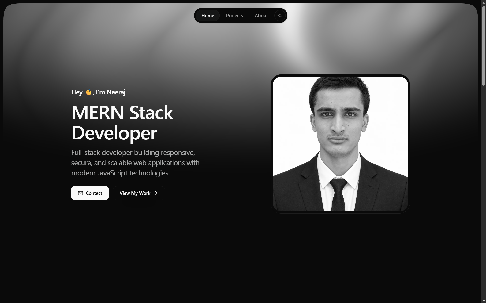
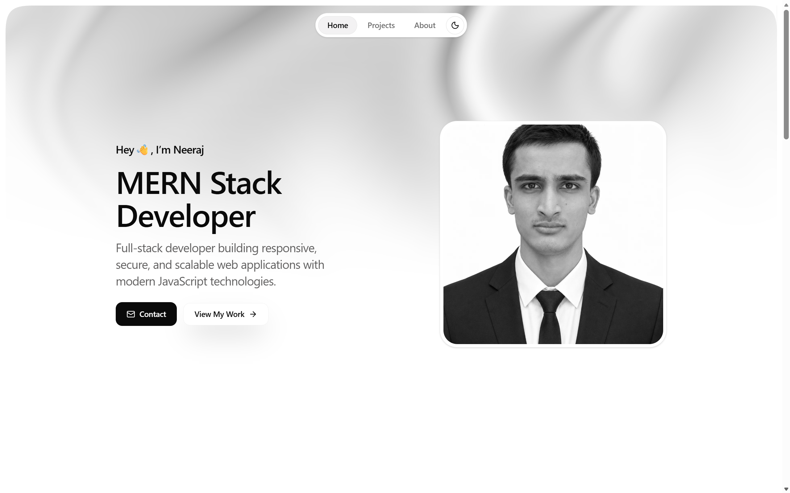

# Neeraj Kumar Saini - Portfolio

Personal portfolio of **Neeraj Kumar Saini**, a MERN Stack Developer based in Rajasthan, India.

**[Live Portfolio](https://neeraj-portfolio-gray.vercel.app)**

<table>
  <tr>
    <td width="50%">
      <a href="https://neeraj-portfolio-gray.vercel.app">
        
      </a>
    </td>
    <td width="50%">
      <a href="https://neeraj-portfolio-gray.vercel.app">
        
      </a>
    </td>
  </tr>
</table>

## Highlights

- Responsive Next.js portfolio with light and dark themes
- Selected personal full-stack and frontend projects
- Current MERN Stack internship experience at UptoSkills
- Verified collaborative contributions to InternOps and AI Mentor
- Accessible navigation, motion preferences, and keyboard focus states
- SEO metadata, Open Graph support, sitemap, robots, and PWA assets

## Technology

- Next.js 16
- React 19
- TypeScript
- Tailwind CSS 4
- Motion
- Matter.js
- OGL / WebGL

## Local development

```bash
npm install
npm run dev
```

Open `http://localhost:3000`.

## Validation

```bash
npm run format:check
npm run lint
npm run typecheck
npm run build
```

## Deployment

Set `NEXT_PUBLIC_SITE_URL` to the production website URL so canonical links, Open Graph metadata, and the sitemap use the correct absolute address.

## Template acknowledgement

Built from the React Bits Pro portfolio template by DavidHDev and extensively customized for Neeraj Kumar Saini.

The original template is free for personal and commercial projects but may not be resold or redistributed as a template. Anyone seeking the reusable template should use the original React Bits Pro source.
